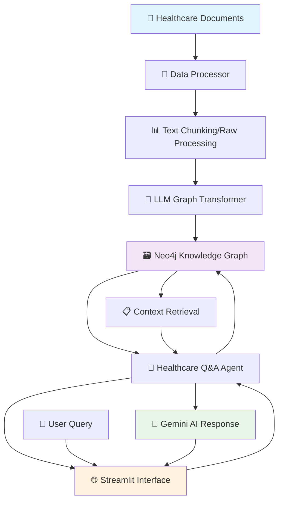

# 🏥 Healthcare Knowledge Graph Q&A System

### _Intelligent healthcare assistant powered by Neo4j knowledge graphs and AI_

<div align="center">


[](https://opensource.org/licenses/MIT)
[](https://github.com/yourusername/healthcare-knowledge-graph)

</div>

---

## 🎯 **Project Overview**

Transform healthcare information into intelligent, searchable knowledge with our advanced Healthcare Knowledge Graph Q&A System. This powerful application combines the graph database capabilities of Neo4j with cutting-edge AI to deliver contextually aware healthcare responses.

### ✨ **Key Features**

<div align="center">

<table>
<tr>
<td width="50%">

#### 🧠 **AI-Powered Healthcare Assistant**
- Natural language healthcare queries
- Context-aware responses using knowledge graphs
- Medical disclaimers and safety guidelines
- Intelligent information synthesis

#### 📊 **Knowledge Graph Processing**
- Automated entity extraction from healthcare documents
- Relationship mapping between medical concepts
- Neo4j graph database integration
- Support for chunked and raw text processing

</td>
<td width="50%">

#### 📄 **Document Processing Pipeline**
- PDF and text file support
- Intelligent text chunking
- Multiple processing modes (chunked/raw)
- Batch processing capabilities

#### 🔍 **Advanced Query System**
- Keyword-based node searching
- Relationship traversal
- Multi-depth connection analysis
- Custom Cypher query support

</td>
</tr>
</table>

</div>

---

## 🏗️ **System Architecture**

<div align="center">



</div>

---

## 📁 **Project Structure**

```
📦 HEALTHCARE_KNOWLEDGE_GRAPH/
├── 🤖 healthcare_agent.py           # Core Q&A Agent with Neo4j Integration
├── 📊 data_processors.py            # Document Processing & Text Chunking
├── 🏗️ enhanced_graph_builder.py     # Knowledge Graph Construction
├── 🗃️ neo4j_processor.py           # Neo4j Database Operations
├── 🌐 gemini.py                     # Google AI Integration
├── 📱 streamlit_app.py             # Web Interface (inferred)
├── 📋 requirements.txt              # Python Dependencies
├── 🔒 .env                         # Environment Configuration
├── 📂 data/                        # Healthcare Documents Directory
│   ├── 📄 medical_guides.pdf
│   ├── 📄 treatment_protocols.txt
│   └── 📄 symptom_database.pdf
├── 🧪 tests/                       # Unit Tests
└── 📖 README.md                    # This Documentation
```

---

## 🛠️ **Technology Stack**

### **Core Technologies**

<div align="center">

<table>
<tr>
<td align="center" width="16.66%">
<br/>
<strong>Neo4j</strong><br/>
<em>Graph Database</em>
</td>
<td align="center" width="16.66%">
<br/>
<strong>Streamlit</strong><br/>
<em>Web Interface</em>
</td>
<td align="center" width="16.66%">
<br/>
<strong>LangChain</strong><br/>
<em>AI Framework</em>
</td>
<td align="center" width="16.66%">
<br/>
<strong>Gemini AI</strong><br/>
<em>Language Model</em>
</td>
<td align="center" width="16.66%">
<br/>
<strong>Python 3.9+</strong><br/>
<em>Core Language</em>
</td>
<td align="center" width="16.66%">
<br/>
<strong>Pydantic</strong><br/>
<em>Data Validation</em>
</td>
</tr>
</table>

</div>

### **Supporting Libraries**

- **📚 Document Processing**: PyPDF2, pypdf, pandas
- **🔧 Text Processing**: RecursiveCharacterTextSplitter
- **🌐 Environment**: python-dotenv, pathlib
- **📊 Data Handling**: JSON, logging, typing

---

## ⚙️ **Quick Start Guide**

### **1. Prerequisites**

```bash
# Python 3.9+ required
python --version

# Neo4j Database (local or cloud)
# Download from: https://neo4j.com/download/
```

### **2. Installation**

```bash
# Clone the repository
git clone https://github.com/yourusername/healthcare-knowledge-graph.git
cd healthcare-knowledge-graph

# Create virtual environment
python -m venv .venv

# Activate virtual environment
# Windows:
.venv\Scripts\activate
# macOS/Linux:
source .venv/bin/activate

# Install dependencies
pip install -r requirements.txt
```

### **3. Configuration**

```bash
# Create .env file with your credentials
cat > .env << EOF
# Google AI Configuration
GEMINI_API_KEY=your_gemini_api_key_here

# Neo4j Configuration
NEO4J_URI=bolt://localhost:7687
NEO4J_USERNAME=neo4j
NEO4J_PASSWORD=your_neo4j_password
EOF
```

### **4. Setup Neo4j Database**

```bash
# Start Neo4j (if running locally)
# Or use Neo4j Desktop/AuraDB

# The application will automatically create necessary indexes
```

### **5. Launch Application**

```bash
# Start the Streamlit application
streamlit run streamlit_app.py
```

---

## 📚 **Core Components**

<div align="center">

<table>
<tr>
<td width="50%">

### **🤖 Healthcare Q&A Agent**

```python
from healthcare_agent import SimpleHealthcareAgent

# Initialize agent
agent = SimpleHealthcareAgent(neo4j_processor)

# Ask healthcare questions
response = agent.get_response(
    "What are the symptoms of diabetes?"
)
```

#### **Features:**
- 🔍 Knowledge graph context retrieval
- ⚕️ Medical disclaimers included
- 💬 Conversation history tracking
- 🛡️ Safety-first response generation

</td>
<td width="50%">

### **📊 Data Processing Pipeline**

```python
from data_processors import DataProcessor

# Initialize processor
processor = DataProcessor(
    chunk_size=200,
    chunk_overlap=30
)

# Process documents
documents = processor.process_directory(
    mode="chunked"  # or "raw"
)
```

#### **Capabilities:**
- 📄 PDF and text file processing
- ✂️ Intelligent text chunking
- 🔄 Batch processing support
- 📁 Directory-wide processing

</td>
</tr>
</table>

</div>

### **🏗️ Graph Builder**

```python
from enhanced_graph_builder import EnhancedGraphBuilder

# Build knowledge graph
builder = EnhancedGraphBuilder()
result = builder.build_graph_from_directory(
    data_dir="data",
    mode="chunked"
)
```

### **🗃️ Neo4j Operations**

```python
from neo4j_processor import Neo4jProcessor

# Connect to Neo4j
processor = Neo4jProcessor()

# Store knowledge graph
success = processor.create_full_knowledge_graph(graph_data)

# Query the graph
nodes = processor.query_by_keyword("diabetes", limit=10)
```

---

## 💻 **Usage Examples**

### **Basic Healthcare Queries**

```python
# Initialize the system
agent = SimpleHealthcareAgent(neo4j_processor)

# Ask about medical conditions
response = agent.get_response("What is hypertension?")
# Response includes context from knowledge graph + medical disclaimers

# Ask about treatments
response = agent.get_response("How is diabetes managed?")
# Provides treatment information with professional consultation advice

# Ask about symptoms
response = agent.get_response("What are early signs of heart disease?")
# Returns symptom information with appropriate medical guidance
```

### **Document Processing Workflow**

```python
# Process new healthcare documents
processor = DataProcessor()

# Single file processing
documents = processor.process_file(
    Path("data/diabetes_guide.pdf"),
    mode="chunked"
)

# Directory processing
all_documents = processor.process_directory(
    mode="raw"  # Combine all files into single context
)

# Build knowledge graph from processed documents
builder = EnhancedGraphBuilder()
graph_result = builder.build_graph_from_documents(documents)
```

---

## 🎨 **Web Interface Features**

### **User Interface Highlights**

- 💬 **Chat Interface**: Natural conversation with the healthcare assistant
- 📊 **Knowledge Graph Visualization**: Interactive graph exploration
- 📄 **Document Management**: Upload and process new healthcare documents
- 🔍 **Search Functionality**: Query the knowledge base directly
- 📈 **Analytics Dashboard**: Usage statistics and system health

### **Safety Features**

- ⚠️ **Medical Disclaimers**: Automatic inclusion in all responses
- 🏥 **Professional Guidance**: Encouragement to consult healthcare providers
- 🛡️ **Information Validation**: Clear source attribution
- ❌ **Limitation Transparency**: Honest about knowledge gaps

---

## 📊 **Processing Modes**

<div align="center">

<table>
<tr>
<th width="50%">🧩 Chunked Mode</th>
<th width="50%">📋 Raw Mode</th>
</tr>
<tr>
<td>

**Advantages:**
- Better for large documents
- Preserves local context
- Efficient memory usage
- Detailed relationship mapping

**Best For:**
- Medical textbooks
- Long treatment guidelines
- Research papers
- Detailed protocols

</td>
<td>

**Advantages:**
- Global document context
- Cross-section relationships
- Simplified processing
- Holistic understanding

**Best For:**
- Short documents
- Executive summaries
- Quick reference guides
- Single-topic resources

</td>
</tr>
</table>

</div>

---

## 🔧 **Advanced Configuration**

### **Customizing the Knowledge Graph**

```python
# Custom node types for healthcare domain
allowed_nodes = [
    "Condition", "Symptom", "Treatment", "Medication",
    "Procedure", "Anatomy", "Risk_Factor", "Prevention"
]

# Custom relationships for medical concepts
allowed_relationships = [
    "CAUSES", "TREATS", "PREVENTS", "SYMPTOM_OF",
    "LOCATED_IN", "REQUIRES", "CONTRAINDICATES"
]

# Initialize with custom configuration
graph_transformer = LLMGraphTransformer(
    llm=llm,
    allowed_nodes=allowed_nodes,
    allowed_relationships=allowed_relationships
)
```

### **Neo4j Query Optimization**

```python
# Create specialized indexes for healthcare data
processor.graph.query("""
    CREATE INDEX condition_name_index 
    IF NOT EXISTS FOR (c:Condition) ON (c.name)
""")

processor.graph.query("""
    CREATE INDEX symptom_severity_index 
    IF NOT EXISTS FOR (s:Symptom) ON (s.severity)
""")
```

---

## 📈 **Performance & Scalability**

### **Optimization Features**

- 🚀 **Batch Processing**: Handle large document sets efficiently
- 🗃️ **Database Indexing**: Optimized Neo4j queries
- 💾 **Memory Management**: Smart chunking for large files
- ⚡ **Async Operations**: Non-blocking document processing

### **Monitoring & Analytics**

- 📊 **Graph Statistics**: Node and relationship counts
- 🔍 **Query Performance**: Response time tracking
- 📈 **Usage Metrics**: User interaction analytics
- 🛠️ **Health Checks**: System status monitoring

---

## 🧪 **Testing**

```bash
# Run unit tests
python -m pytest tests/

# Test individual components
python -m pytest tests/test_healthcare_agent.py
python -m pytest tests/test_data_processors.py
python -m pytest tests/test_neo4j_processor.py

# Integration tests
python -m pytest tests/test_integration.py -v
```

---

## 🚀 **Deployment**

### **Local Development**

```bash
# Development mode with auto-reload
streamlit run streamlit_app.py --server.runOnSave true

# Custom port configuration
streamlit run streamlit_app.py --server.port 8501
```

### **Production Deployment**

```dockerfile
# Dockerfile example
FROM python:3.9-slim

WORKDIR /app
COPY requirements.txt .
RUN pip install uv
RUN uv pip install -r requirements.txt

COPY . .

EXPOSE 8501

CMD ["uv", "run", "streamlit_app.py", "--server.address", "0.0.0.0"]
```

---

## 🤝 **Contributing**

We welcome contributions to improve the Healthcare Knowledge Graph system!

### **Development Workflow**

1. 🍴 **Fork** the repository
2. 🌿 **Create** feature branch (`git checkout -b feature/medical-terminology`)
3. ✨ **Commit** changes (`git commit -m 'Add medical terminology support'`)
4. 📤 **Push** to branch (`git push origin feature/medical-terminology`)
5. 🔄 **Open** Pull Request

### **Code Standards**

- 🐍 **PEP 8** compliance
- 📝 **Type hints** for all functions
- 🧪 **Unit tests** for new features
- 📖 **Docstring documentation**
- ⚕️ **Medical accuracy** verification

---

## 📄 **License**

This project is licensed under the MIT License - see the [LICENSE](LICENSE) file for details.

---

## ⚠️ **Important Disclaimers**

<div align="center">

### 🏥 **Medical Information Notice**

**This system is for informational purposes only and should not replace professional medical advice, diagnosis, or treatment. Always consult with qualified healthcare professionals for medical decisions.**

</div>

---

## 📞 **Support & Contact**

- 🐛 **Bug Reports**: [GitHub Issues](https://github.com/yourusername/healthcare-knowledge-graph/issues)
- 💡 **Feature Requests**: [GitHub Discussions](https://github.com/yourusername/healthcare-knowledge-graph/discussions)
- 📧 **Email Support**: lshreechaithanya@gmail.com

---

<div align="center">

### 💙 **Built with ❤️ for Healthcare Innovation**

_Empowering healthcare decisions through intelligent knowledge systems_

[⭐ Star this repo](https://github.com/yourusername/healthcare-knowledge-graph) • [🐛 Report Bug](https://github.com/yourusername/healthcare-knowledge-graph/issues) • [💡 Request Feature](https://github.com/yourusername/healthcare-knowledge-graph/discussions)

---

**Made with 🏥 Healthcare • 🧠 AI • 📊 Knowledge Graphs**

</div>